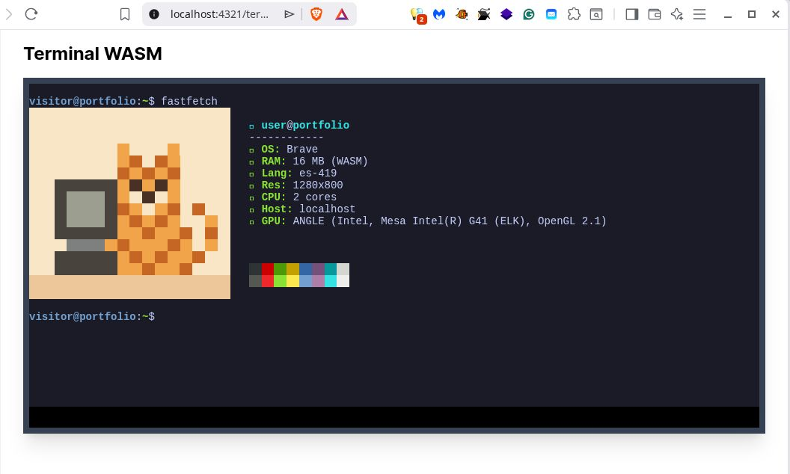
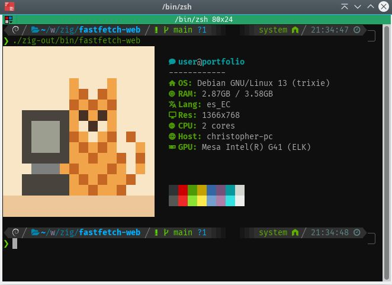

# zigfetch

A neofetch-style system info display compiled to **WebAssembly (WASI)**, running inside a browser terminal. Built with Zig — the same binary works natively on Linux and as a WASM module in the browser.

## Screenshots

### Web (Brave)


### Linux (Debian)


---

## Features

| Field | Linux | Browser |
|-------|-------|---------|
| 󰋜 OS | `/etc/os-release` | Browser name (Brave, Chrome, Firefox…) |
| 󰍛 RAM | `sysinfo` syscall | WASM module memory |
| 󰗊 Lang | `$LANG` env var | `navigator.language` |
| 󰍹 Res | `xrandr` | `screen.width x screen.height` |
| 󰻠 CPU | `/proc/cpuinfo` | `navigator.hardwareConcurrency` |
| 󰖟 Host | `gethostname()` | `location.hostname` |
| 󰢮 GPU | `glxinfo -B` | `WEBGL_debug_renderer_info` |

---

## How It Works

The project compiles a single Zig codebase to two targets:

```
zig build                              # Native Linux binary
zig build -Dtarget=wasm32-wasi         # WASM module for the browser
```

In the browser, the WASM module runs inside a Web Worker with a custom WASI implementation. System info that requires browser APIs (resolution, GPU, language) is captured from the main thread and injected into the WASM module via `extern "env"` function imports.

```
terminal.js (main thread)
  │  captures: screen, GPU, navigator.*
  │  postMessage → 
  └─ wasi_worker.js (Web Worker)
       │  implements: WASI syscalls + env imports
       └─ zigfetch.wasm
            │  calls: getBrowserName(), getResolution(), getGpu()...
            └─ prints via fd_write → postMessage → xterm.js
```

---

## Project Structure

```
src/
├── main.zig              # Entry point and render loop
├── info/
│   ├── os.zig            # Linux OS name from /etc/os-release
│   ├── ram.zig           # RAM via sysinfo (Linux) or @wasmMemorySize
│   ├── browser.zig       # extern "env" imports from JS host
│   └── system.zig        # Linux: language, resolution, GPU, hostname
└── render/
    └── logo.zig          # Color palette renderer

public/scripts/
├── terminal.js           # xterm.js shell, captures browser info
└── wasi_worker.js        # WASI runtime implementation in JS
```

---

## Requirements

### To build

- [Zig 0.13](https://ziglang.org/download/)

### Optional (Linux native, for full info)

- `xrandr` — screen resolution
- `glxinfo` (`mesa-utils`) — GPU renderer

### Browser requirements

- `SharedArrayBuffer` support (requires COOP/COEP headers)
- Chromium-based browser recommended for `WEBGL_debug_renderer_info`

---

## Building

```bash
# Native Linux binary
zig build -Doptimize=ReleaseSmall

# WASM module for the browser
zig build -Doptimize=ReleaseSmall -Dtarget=wasm32-wasi

# Run locally
./zig-out/bin/zigfetch

# Test WASM with wasmer
wasmer zig-out/bin/zigfetch.wasm
```

---

## Serving in the Browser

The site must be served with these HTTP headers for `SharedArrayBuffer` to work:

```
Cross-Origin-Embedder-Policy: require-corp
Cross-Origin-Opener-Policy: same-origin
```

Without these headers the terminal will display an error instead of loading.

---

## Browser Compatibility

| Browser | OS Name | GPU Renderer | RAM |
|---------|---------|--------------|-----|
| Chrome / Edge | ✅ | ✅ | ⚠️ `performance.memory` (approx) |
| Brave | ✅ | ✅ (unblocked) | ❌ blocked by anti-fingerprint |
| Firefox | ✅ | ❌ blocked? | ❌ blocked? |
| Safari | ✅ | ❌ blocked? | ❌ blocked? |

GPU info and RAM availability depend on the browser's privacy settings. Fields show graceful fallbacks when unavailable.

---

## Adding New Fields

1. **Capture in `terminal.js`** (if the API is main-thread only):
```javascript
const myValue = someMainThreadAPI();
worker.postMessage({ ..., myValue });
```

2. **Expose in `wasi_worker.js`**:
```javascript
const { myValue } = e.data;
// in env:
getMyValueLen: () => myValue.length,
getMyValue: (ptr) => { /* write to WASM memory */ },
```

3. **Declare extern in `src/info/browser.zig`**:
```zig
extern "env" fn getMyValueLen() u32;
extern "env" fn getMyValue(ptr: [*]u8) void;

pub fn getMyValue(allocator: std.mem.Allocator) []const u8 { ... }
```

4. **Add Linux fallback in `src/info/system.zig`** and wire both in `main.zig`.

---

## License

MIT
